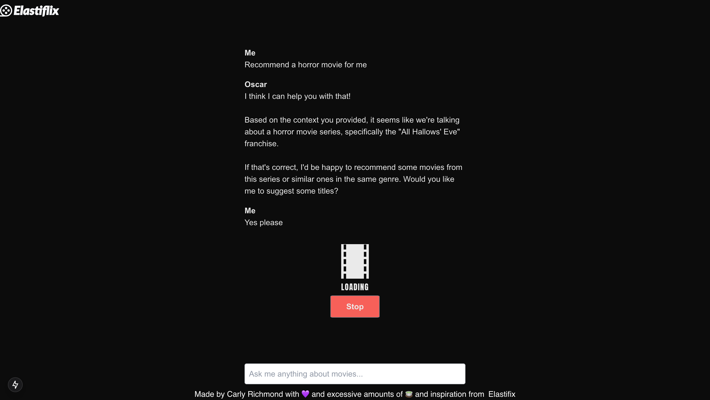
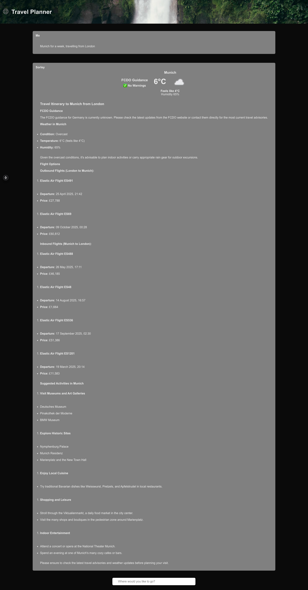

# [Webdevcon] Grounding AI Applications with React, JavaScript, Langchain and Elasticsearch Workshop

This repo contains the content and final solution for the "Grounding AI Applications with JavaScript, Langchain and Elasticsearch" workshop, given at Webdevcon.

## Final Result

This workshop will walk through the building of 2 AI applications: 

1. Oscar: a simple RAG-based chat-bot using vector search. You will be exposed to AI SDK, Elasticsearch and Langchain.



2. Sorely, a travel planning agent initially featured in [this GitHub repo] for an upcoming [Elasticsearch Labs](https://www.elastic.co/search-labs) piece. Here you will use AI SDK and Elasticsearch together to build an interactive UI sourcing data from Elasticsearch and APIs from [GOV.UK FCDO](https://content-api.publishing.service.gov.uk/reference.html#path-get) and [Weather API](https://www.weatherapi.com/).



## Getting Started

Prior to building the applications using the supplied [worksheets](./lab-sheets/), please ensure you have met [the stated install prerequisites](./lab-sheets/0-prerequisites.md).

Initialising the starting point RAG application is possible via the below commands:

```zsh
cd oscar
npm install
```

For the AI agent application, please use the below commands:

```zsh
cd sorely
npm install
```

*Note: if you receive error **You are using Node.js 19.0.0. For Next.js, Node.js version "^18.18.0 || ^19.8.0 || >= 20.0.0" is required.**, ensure you are using a compatible version of Node.js using the below steps:*

```zsh
nvm install 20.13.1
nvm use 20.13.1
```

## Technologies Used

1. [Elasticsearch](https://www.elastic.co/guide/en/elasticsearch/reference/current/index.html) and the [Elasticsearch JavaScript client](https://www.elastic.co/guide/en/elasticsearch/client/javascript-api/current/index.html)
2. [Langchain JS](https://js.langchain.com/docs/introduction/)
3. [Ollama](https://ollama.com/)
4. [AI by Vercel SDK, including the UI SDK](https://sdk.vercel.ai/)
5. [React](https://react.dev/), specifically [Next.js](https://nextjs.org/)

### Alternative Technologies

1. [LlamaIndex TS](https://ts.llamaindex.ai/) is an alternative to Langchain and AI SDK that also has TypeScripts support.
2. [Mastra](https://mastra.ai/) is a TypeScript AI framework similar to AI SDK.