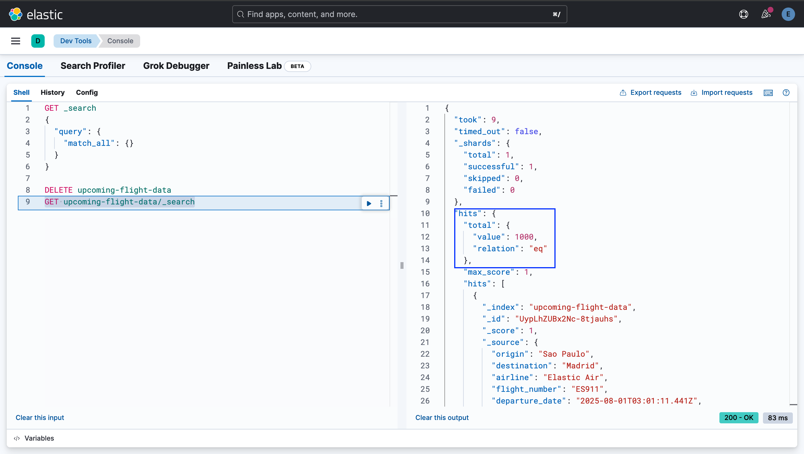

# Lab 1.1: Data Ingestion

In this section we are going to populate our Elasticsearch cluster with flight data. There are many different ways to ingest data into an Elasticsearch cluster:

1. [Elastic Beats](https://www.elastic.co/beats)
2. [Logstash](https://www.elastic.co/logstash)
3. [Elastic Agent](https://www.elastic.co/elastic-agent)
4. [Language clients](https://www.elastic.co/guide/en/elasticsearch/client/index.html) (such as the [Node.js client bulk index example](https://www.elastic.co/guide/en/elasticsearch/client/javascript-api/current/bulk_examples.html))

We shall use the [Elasticsearch JavaScript client](https://www.elastic.co/guide/en/elasticsearch/client/javascript-api/current/index.html) to create and populate our index. An inverted index is a data structure, much like the index of a book, where key terms are stored alongside a reference to the document in which they reside:


## Steps

### Data Source

We shall be using dummy flight data using the provided [`ingestion.ts` script](../../sorely/src/app/scripts/ingestion.ts).

### Document Ingestion

1. Update your `.env` file under the `sorely` folder to include your Elastic endpoint and required keys. Once changed it should look similar to the following:

```zsh
OPENAI_API_KEY=ARandomOpenAIKey?
WEATHER_API_KEY=MyWeatherKey!
ELASTIC_DEPLOYMENT=http://localhost:9200
ELASTIC_API_KEY=ARandomKey!
```

Run `direnv allow` will refresh your env variables in the terminal

2. Install dependencies and start the application to check it's working:

```zsh
cd sorely
npm install # key dependencies: ai @ai-sdk/openai zod @elastic/elasticsearch
npm run dev
```

You should be able to see a placeholder applications by navigating in your browser to `http://localhost:3000`. 


*Note that you need to stop the Oscar application as it runs against the same default port and will cause a conflict*.

3. Run the utility script to generate sample flight data in index `upcoming-flight-data`:

```zsh
direnv allow
tsx src/app/scripts/ingestion.ts
```

If you have a dig into the `ingestion.ts` script, you'll see the script uses the Elasticsearch JavaScript Client that we used in part 1 to create an index and populate it with generated flight data.

If the script completes successfully, navigate to the Kibana DevTools screen, available at http://localhost:5601, and run the following query to ensure the index is populated with flight documents:

```json
GET upcoming-flight-data/_search
```

## Expected Result

If all goes well you should see that the console confirms that documents have been ingested:

```zsh
...
Document 998 indexed
Document 999 indexed
```

Checking in Kibana, you should see 1000 records in the index as shown below:



Please contact the facilitator if you see any failure messages.