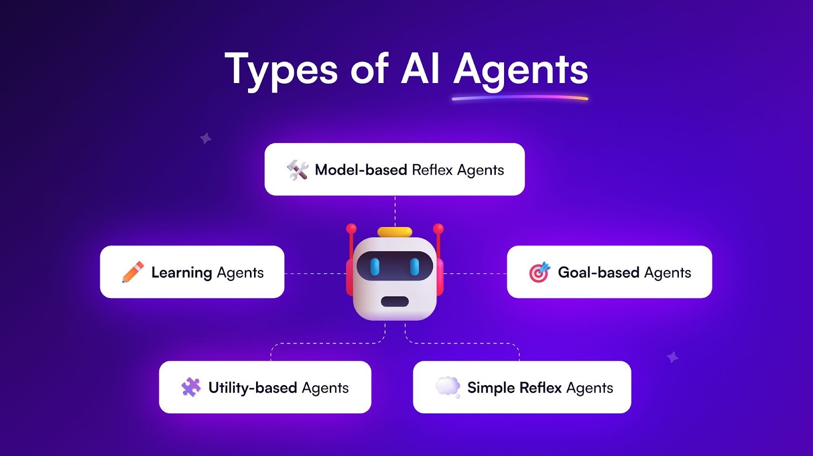
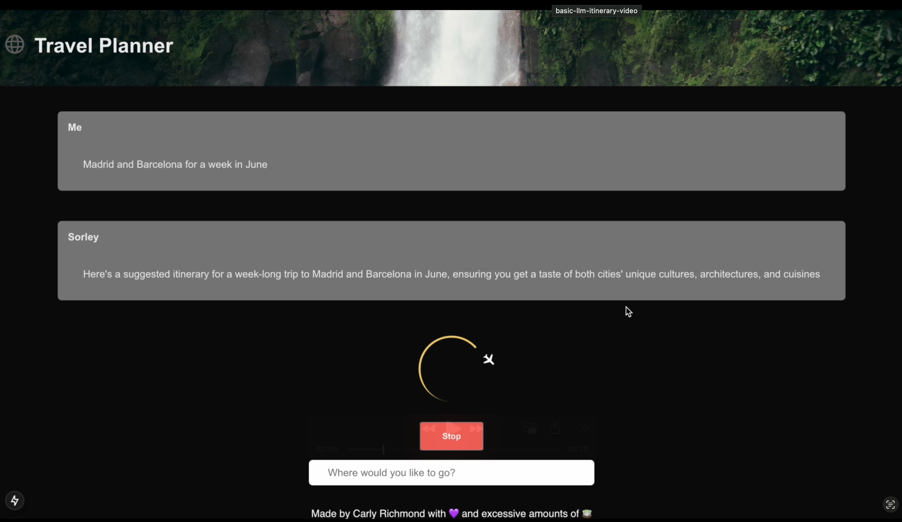

# Lab 2.2: Intro to Agents

In this section we are going to explore in more detail what AI Agents are and experiment with the AI SDK hooks. By the end of this segment you should understand what agents are, how RAG fits into the picture, and how to simply invoke an LLM.

## Background

### What is an AI Agent?

An AI agent is software that is able to perform tasks autonomously using AI to take actions on behalf of a human. It achieves this by combining one or more LLMs with developer-defined tools (or functions) to perform particular actions and help the LLM build a richer response. Example actions in these tools could be:

1. Extraction information from databases, sensors, APIs, search engines such as Elasticsearch or other sources for the LLM to base it's response on.
2. Performing complex calculations. Those results can then be used by the LLM to inform the response.
3. Making key decisions based on data inputs quickly.
4. Raising alerts and feedback based on the response.

### Agent Types

What use cases can you think of? Do note them down and share with the attendees. 

There are several different types of AI Agents:



1. Simple reflex agents that are pre-programmed to perform actions based on a particular condition being met. The obvious here would be a home thermostat that is programmed to switch on the heating at a particular time. Or the simple, friendly chatbots many e-commerce organisations use to initiate simple requests on behalf of users. LLMs are not agents as they simply generate text and do not take actions or make decisions.
2. Goal-based agents that their own internal model alongside a set of goals to search for actions to execute to meet said goal. A trusty navigation system or a system to recommend investments based on a financial target would be key examples. 
3. Model-based reflex agents that make real-time decisions based on input from sensors, such as self-driving cars or automated vacuum cleaners.
4. Learning agents that combine data and machine learning to identify patterns and exceptions in cases such as fraud detection.
5. Utility agents that recommend investment decisions based on a person's risk market and existing portfolio to maximize their return. With my former finance hat on this could expedite such decisions if accuracy, reputational risk and regulatory factors are carefully weighted. 

If you want to read more check out the below resources:

1. [What are AI agents? | IBM](https://www.ibm.com/think/topics/ai-agents)
2. [What are AI Agents? A Complete Guide For Beginners in 2025 | igmGuru](https://www.igmguru.com/blog/what-are-ai-agents)

### RAG versus AI agents

As covered earlier when building RAG into the [Oscar chatbot](../1-oscar/1.6-rag-integration.md), RAG is a software architecture used to provide documents the LLM was not trained as context to allow them to generate a more accurate response and reduce the propensity to hallucinate.

## Steps

1. Let's build the most basic chatbot page to start our journey using the [`useChat` hook](https://sdk.vercel.ai/docs/reference/ai-sdk-ui/use-chat) in [`page.tsx`](../../sorely/src/app/page.tsx):

```tsx
'use client';

import { useChat } from '@ai-sdk/react';

export default function Chat() {
  /* useChat hook helps us handle the input, resulting messages, and also handle the loading and error states for a better user experience */
  const { messages, input, handleInputChange, handleSubmit } = useChat();

  return (
    <div className="chat__form">
      <div className="chat__messages">
        {
          /* Display all user messages and assistant responses */
          messages.map(m => (
          <div key={m.id} className="message">
            <div>
              { /* Messages with the role of *assistant* denote responses from the LLM*/ }
              <div className="role">{m.role === "assistant" ? "Sorley" : "Me"}</div>
              { /* User or LLM generated content */}
                <div className="itinerary__div">{m.content}</div>
            </div>
          </div>
        ))}
      </div>

      { /* Form using default input and submission handler form the useChat hook */ }
      <form onSubmit={handleSubmit}>
        <input
          className="search-box__input"
          value={input}
          placeholder="Where would you like to go?"
          onChange={handleInputChange}
        />
      </form>
    </div>
  );
}
```

2. At the moment it doesn't do very much as there is no API endpoint for it to interact with. By default the chat endpoint initiates a call to `/api/chat`. Create the route making a call to your locally running `llama3.1` model under `/api/chat/route.ts`:

```ts
import { createOllama } from 'ollama-ai-provider';
import { generateText } from 'ai';
import { NextResponse } from 'next/server';

export const maxDuration = 30;

const ollama = createOllama({
  baseURL: 'http://localhost:11434/api', // Default
});

// Post request handler
export async function POST(req: Request) {
  const { messages } = await req.json();
  
  try {
    const { response } = await generateText({
    model: ollama('llama3.1'),
    system: 'You are a helpful assistant that returns travel itineraries',
    messages
  });
  
  return Response.json({ messages: response.messages });
  } catch(e) {
    console.error(e);
    return new NextResponse("Unable to generate a plan. Please try again later!");
  }
}
```

3. What you'll see is that `generateText` takes considerable time to response as it's waiting for the full response before returning. Given the length of response we can see, especially for more chatty models, best practice is to send the data back as a stream. 

Amend your bot to use the `streamText` method instead:

```tsx
import { createOllama } from 'ollama-ai-provider';
import { generateText } from 'ai';
import { NextResponse } from 'next/server';

// Allow responses up to 30 seconds to address typically longer responses from LLMs
export const maxDuration = 30;

const ollama = createOllama({
  baseURL: 'http://localhost:11434/api', // Default
});

// Post request handler
export async function POST(req: Request) {
  const { messages } = await req.json();
  
  try {
    const result = streamText({
      model: ollama('llama3.1'),
      system: 'You are a helpful assistant that returns travel itineraries',
      messages
    });

    return result.toDataStreamResponse();
  } catch(e) {
    console.error(e);
    return new NextResponse("Unable to generate a plan. Please try again later!");
  }
}
```

4. Right now, we're not really communicating the status with the user. Let's add support for a spinner and error handling in `page.tsx`:

```tsx
'use client';

import { useChat } from '@ai-sdk/react';
import Spinner from './components/spinner';

export default function Chat() {
  /* useChat hook helps us handle the input, resulting messages, and also handle the loading and error states for a better user experience */
  const { messages, input, handleInputChange, handleSubmit, isLoading, stop, error, reload } = useChat();

  return (
    <div className="chat__form">
      <div className="chat__messages">
        {
          /* Display all user messages and assistant responses */
          messages.map(m => (
          <div key={m.id} className="message">
            <div>
              { /* Messages with the role of *assistant* denote responses from the LLM*/ }
              <div className="role">{m.role === "assistant" ? "Sorley" : "Me"}</div>
              { /* User or LLM generated content */}
                <div className="itinerary__div">{m.content}</div>
            </div>
          </div>
        ))}
      </div>

      {
        /* Spinner shows when awaiting a response */
        isLoading && (
        <div className="spinner__container">
          <Spinner />
          <button id="stop__button" type="button" onClick={() => stop()}>
            Stop
          </button>
        </div>
      )}

      {
      /* Show error message and return button when something goes wrong */
      error && (
        <>
          <div className="error__container">Unable to generate a plan. Please try again later!</div>
          <button id="retry__button" type="button" onClick={() => reload()}>
            Retry
          </button>
        </>
      )}

      { /* Form using default input and submission handler form the useChat hook */ }
      <form onSubmit={handleSubmit}>
        <input
          className="search-box__input"
          value={input}
          placeholder="Where would you like to go?"
          onChange={handleInputChange}
          disabled={error != null}
        />
      </form>
    </div>
  );
}
```

4. At this time you could take some time to play with [one of the other hooks](https://sdk.vercel.ai/docs/ai-sdk-ui/overview#ui-framework-support). Can you get the above working with the `useCompletion` or `useAssistant` hooks? What limitations or advantages do you see?

## Expected Result

Before experimenting with other hooks, you should have a very basic chat app that generates itineraries:



We don't currently have an AI agent as it doesn't invoke tools or perform actions... yet!