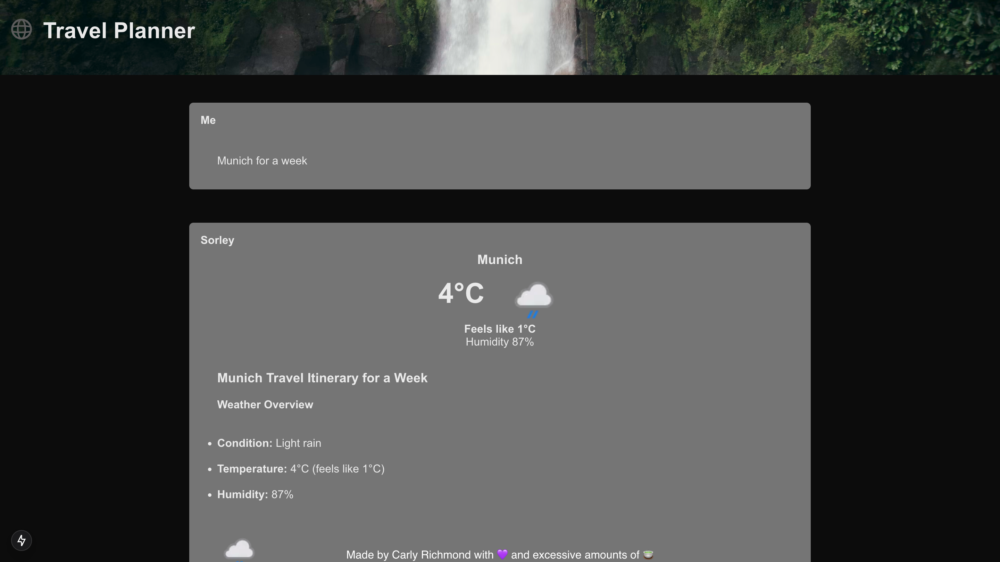

# Lab 2.1: Adding Your First Tool

Here we shall lean more into agents and write our first tool! This simple weather tool shall get the weather for the location in the user prompt and show it on the UI.

## Steps

1. Create a new TypeScript file `/ai/weather.tool.ts` to return dummy weather information without any parameters:

```ts
import { tool as createTool } from 'ai';

import { WeatherResponse } from '../model/weather.model';

export const weatherTool = createTool({
  description: 
  'Display the weather'
  execute: async function () {
      return { 
        location: 'Amsterdam', 
        condition: 'Sunny', 
        condition_image: null,
        temperature: 11,
        feels_like_temperature: 9,
        humidity: 0.25
      };
    } 
  }
});
```

2. Add the tool to the LLM invocation on your `route.ts`:

```tsx
import { weatherTool } from '@/app/ai/weather.tool';

// Other imports omitted

export const tools = {
  displayWeather: weatherTool,
};

// Post request handler
export async function POST(req: Request) {
  const { messages } = await req.json();
  
    const result = streamText({
      model: ollama('llama3.1'),
      system: 'You are a helpful assistant that returns travel itineraries',
      messages,
      maxSteps: 2,
      tools
    });

    // Return data stream to allow the useChat hook to handle the results as they are streamed through for a better user experience
    return result.toDataStreamResponse();
}
```

What happens? Does the behaviour change when you change the system prompt to use the weather information, similar to the below prompt?

```ts
system: 'You are a helpful assistant that returns travel itineraries based on the specified location.'
```

3. Now lets add the `location` attribute to our tool using the `zod` Typescript schema library:

```ts
import { tool as createTool } from 'ai';
import { z } from 'zod';

import { WeatherResponse } from '../model/weather.model';

export const weatherTool = createTool({
  description: 
  'Display the weather for a holiday location',
  parameters: z.object({
    location: z.string().describe('The location to get the weather for')
  }),
  execute: async function ({ location }) {
    return { 
        location: 'Amsterdam', 
        condition: 'Sunny', 
        condition_image: null,
        temperature: 11,
        feels_like_temperature: 9,
        humidity: 0.25
      };
  }
});
```

Set a breakpoint and see what the value of `location` is when the tool is invoked.

5. Let's change the tool to invoke the Weather API that we obtained a key for [as part of the pre-requisites](../0-prerequisites.md):

```ts
import { tool as createTool } from 'ai';
import { z } from 'zod';

import { WeatherResponse } from '../model/weather.model';

export const weatherTool = createTool({
  description: 
  'Display the weather for a holiday location',
  parameters: z.object({
    location: z.string().describe('The location to get the weather for')
  }),
  execute: async function ({ location }) {
    // While a historical forecast may be better, this example gets the next 3 days
    const url = `https://api.weatherapi.com/v1/forecast.json?q=${location}&days=3&key=${process.env.WEATHER_API_KEY}`;
    
    try {
      const response = await fetch(url);
      const weather : WeatherResponse = await response.json();
      return { 
        location: location, 
        condition: weather.current.condition.text, 
        condition_image: weather.current.condition.icon,
        temperature: Math.round(weather.current.temp_c),
        feels_like_temperature: Math.round(weather.current.feelslike_c),
        humidity: weather.current.humidity
      };
    } catch(e) {
      console.error(e);
      return { 
        message: 'Unable to obtain weather information', 
        location: location
      };
    }
  }
});
```

If you don't have a key please contact the facilitator.

4. In addition to using the information in generated output, we can also amend our UI to show the returned weather information. Change the `page.tsx` code to include the pre-made `weather.tsx` React component when our weather tool has been invoked:

```tsx
'use client';

import { useChat } from '@ai-sdk/react';
import Image from 'next/image';

import { Weather } from './components/weather';

import pending from '../../public/multi-cloud.svg';

export default function Chat() {
  const { messages, input, handleInputChange, handleSubmit, isLoading, stop, error, reload } = useChat();

  return (
    <div className="chat__form">
      <div className="chat__messages">
        {
          messages.map(m => (
            <div key={m.id} className="message">
              <div>
                <div className="role">{m.role === "assistant" ? "Sorley" : "Me"}</div>
                <div className="tools__summary">
                  {
                    m.parts.map(part => {
                      if (part.type === 'tool-invocation') {
                        const { toolName, toolCallId, state } = part.toolInvocation;

                        if (state === 'result') {
                          if (toolName === 'displayWeather') {
                            const { result } = part.toolInvocation;
                            return (
                              <div key={toolCallId}>
                                <Weather {...result} />
                              </div>
                            );
                          }
                        } else {
                          return (
                            <div key={toolCallId}>
                              {toolName === 'displayWeather' ? (
                                <div className="weather__tool">
                                  <Image src={pending} width={80} height={80} alt="Placeholder Weather"/>
                                  <p className="loading__weather__message">Loading weather...</p>
                                </div>
                              ) : null}
                            </div>
                          );
                        }
                      }
                    })}
                </div>
                <div className="itinerary__div">{m.content}</div>
              </div>
            </div>
          ))}
      </div>

      {
        isLoading && (
        <div className="spinner__container">
          <Spinner />
          <button id="stop__button" type="button" onClick={() => stop()}>
            Stop
          </button>
        </div>
      )}

      { 
        error && (
        <>
          <div className="error__container">Unable to generate a plan. Please try again later!</div>
          <button id="retry__button" type="button" onClick={() => reload()}>
            Retry
          </button>
        </>
      )}

      <form onSubmit={handleSubmit}>
        <input
          className="search-box__input"
          value={input}
          placeholder="Where would you like to go?"
          onChange={handleInputChange}
          disabled={error != null}
        />
      </form>
    </div>
  );
}
```

What does the output look like when you ask the planner to generate an itinerary for "a week in Amsterdam"?

# Expected Result

If all goes well, following a loading indicator for the tool, that the weather data is populated in the chat window:

