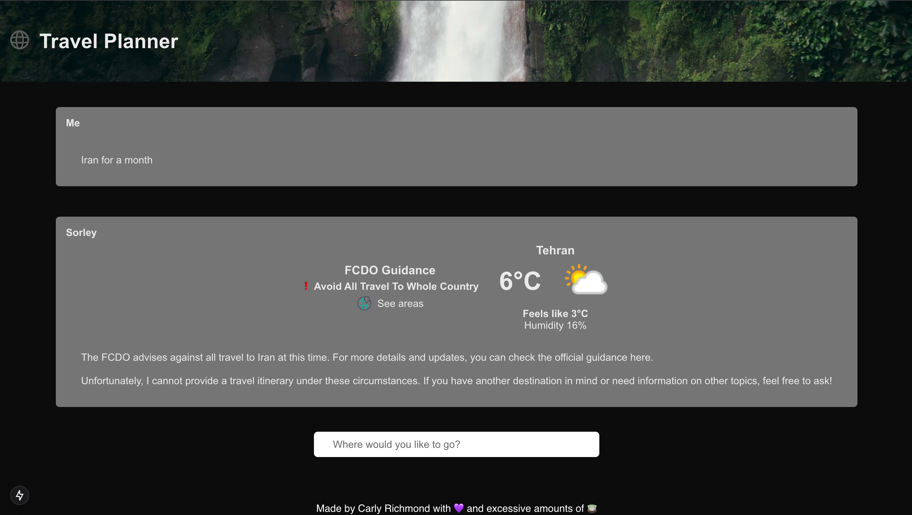

# Lab 2.5: Model Choice

At this point, you may be wondering why only one tool is being called at a time. Now is a good time for us to discuss model choice and how different models behave when it comes to executing tools.

## Background

Choosing a model is hard. There are numerous factors that may influence which model you use for work and personal projects, including:

1. License conditions, ethical considerations and any other usage conditions. 
2. Community usage terms, such as the information you agree to be collected by the model when used. Depending on the model this can include contact information and location data.
3. Parameters.
4. Modality, particularly for multi-modal use cases involving images, sound and text.
5. Content length.
6. Size and hardware requirements.
7. Training dataset, including the knowledge cut off date.
8. Training time, consumption and emissions.
9. Language support. While the majority of languages support English, if your use case needs to support other languages it's important to check they are supported.
10. Tool calling support, especially in our case.
11. Intended use conditions. Whether the model is permitted for commercial, personal or research purposes is important for enterprise use cases.
12. Performance benchmarks.

While all this information may not be publicly available for every model you consider, checking out the corresponding model card, such as [this one for Llama-3.1-8B](https://huggingface.co/meta-llama/Llama-3.1-8B), can help you find the answers to questions on these topics. 

Leaderboards are also useful to find potential models for your use case. A quick search will uncover many, as will looking in popular model repositories such as Hugging Face and their [finding leaderboards documentation](https://huggingface.co/docs/leaderboards/en/leaderboards/finding_page). Key leaderboards to look out for include:

1. [Hugging Face Open LLM leaderboard](https://huggingface.co/spaces/open-llm-leaderboard/open_llm_leaderboard#/), which also [accepts submissions](https://huggingface.co/docs/leaderboards/en/open_llm_leaderboard/submitting)
2. [Artificial Analysis LLM Leaderboard](https://artificialanalysis.ai/leaderboards/models)
3. [Berkley Function-Calling Leaderboard, or BFCL](https://gorilla.cs.berkeley.edu/leaderboard.html)

Let's play with some models and tool parameters to see if we can get the LLM to call both tools in parallel.

## Steps 

1. Currently we have set `maxSteps` to `2` in our configuration. With breakpoints set on each tool, try increasing the `maxSteps` option in `route.ts` to 5 and see what happens:

```ts
const result = streamText({
      model: ollama('llama3.1'),
      system:
      "You are a helpful assistant that returns travel itineraries based on a location" +
        "Use the current weather from the displayWeather tool to adjust the itinerary and give packing suggestions." +
        "If the FCDO tool warns against travel DO NOT generate an itinerary.",
      messages,
      maxSteps: 5,
      tools
    });
```

You may also find it helpful to use the [`onStepFinish` method](https://sdk.vercel.ai/docs/reference/ai-sdk-core/stream-text#on-step-finish) with a breakpoint to inspect each step in turn:

```ts
const result = streamText({
      model: ollama('llama3.1'),
      system:
      "You are a helpful assistant that returns travel itineraries based on a location" +
        "Use the current weather from the displayWeather tool to adjust the itinerary and give packing suggestions." +
        "If the FCDO tool warns against travel DO NOT generate an itinerary.",
      messages,
      maxSteps: 5,
      tools,
      onStepFinish: (stepResult) => {
        console.log(stepResult.toolCalls);
      }
    });
```

What do you see?

2. You may have noticed that increasing the `maxSteps` attribute to allow the LLM to initiate more steps does not influence the calling of both tools. Let's revert that change and try and use the [`toolChoice](https://sdk.vercel.ai/docs/reference/ai-sdk-core/stream-text#tool-choice) settings to enforce calling of tools:

```ts
const result = streamText({
      model: ollama('llama3.1'),
      system:
      "You are a helpful assistant that returns travel itineraries based on a location" +
        "Use the current weather from the displayWeather tool to adjust the itinerary and give packing suggestions." +
        "If the FCDO tool warns against travel DO NOT generate an itinerary.",
      messages,
      maxSteps: 2,
      tools,
      toolChoice: "required",
      onStepFinish: (stepResult) => {
        console.log(stepResult.toolCalls);
      }
    });
```

What happens? Do you see an exception per chance?

3. Let's try changing the prompt to include a message explaining to the LLM that the tools are available, similar to the [example here](https://huggingface.co/HuggingFaceTB/SmolLM2-1.7B-Instruct/blob/main/instructions_function_calling.md):

```ts
const result = streamText({
      model: ollama('llama3.1'),
      system:
      "You are a helpful assistant that returns travel itineraries based on a location" +
      `You have access to the following tools: 

      <tools>${tools}</tools>
      
      ` +
        "Use the current weather from the displayWeather tool to adjust the itinerary and give packing suggestions." +
        "If the FCDO tool warns against travel DO NOT generate an itinerary.",
      messages,
      maxSteps: 2,
      tools,
      onStepFinish: (stepResult) => {
        console.log(stepResult.toolCalls);
      }
    });
```

Does that change the execution? 

4. What about if you change the model to `smollm2` that you (hopefully) also installed as part of the prerequisites?

```ts
const result = streamText({
      model: ollama('smollm2'),
      system:
      "You are a helpful assistant that returns travel itineraries based on a location" +
      `You have access to the following tools: 

      <tools>${tools}</tools>
      
      ` +
        "Use the current weather from the displayWeather tool to adjust the itinerary and give packing suggestions." +
        "If the FCDO tool warns against travel DO NOT generate an itinerary.",
      messages,
      maxSteps: 2,
      tools,
      onStepFinish: (stepResult) => {
        console.log(stepResult.toolCalls);
      }
    });
```

5. For the remainder of the workshop we shall use [GPT-4o Turbo](https://platform.openai.com/docs/models). In this case, since Ollama doesn't provide the model, we need to change the provider to the [AI SDK OpenAI provider](https://sdk.vercel.ai/providers/ai-sdk-providers/openai):

```ts
import { openai } from '@ai-sdk/openai';
import { streamText } from 'ai';
import { NextResponse } from 'next/server';

import { weatherTool } from '@/app/ai/weather.tool';
import { fcdoTool } from '@/app/ai/fcdo.tool';

export const maxDuration = 30;

export const tools = {
  displayWeather: weatherTool,
  fcdoGuidance: fcdoTool
};

// Post request handler
export async function POST(req: Request) {
  const { messages } = await req.json();

  try {
    const result = streamText({
      model: openai('gpt-4-turbo'),
      system:
      "You are a helpful assistant that returns travel itineraries based on a location" +
        "Use the current weather from the displayWeather tool to adjust the itinerary and give packing suggestions." +
        "If the FCDO tool warns against travel DO NOT generate an itinerary.",
      messages,
      maxSteps: 2,
      tools
    });

    return result.toDataStreamResponse();
  } catch (e) {
    console.error(e);
    return new NextResponse(
      "Unable to generate a plan. Please try again later!"
    );
  }
}

```

Hopefully you should now see that both tools run. Score!

6. Let's also tidy up the output. GPT models send their text output in Markdown format. Change the output in `div .itinerary__div` within `page.tsx` to use [Showdown JS](https://showdownjs.com/) to format the output as HTML:

```tsx
<div className="itinerary__div" dangerouslySetInnerHTML={{ __html: markdownConverter.makeHtml(m.content)}}></div>
```

## Expected Result

Following changing to use GPT-4o Turbo, you should see that both the weather and FCDO tools are being called by the LLM in response to our prompts:

