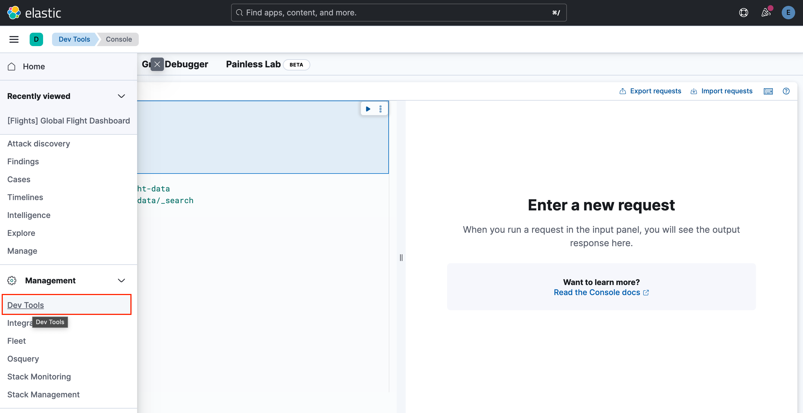
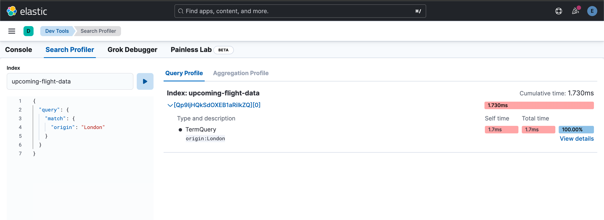
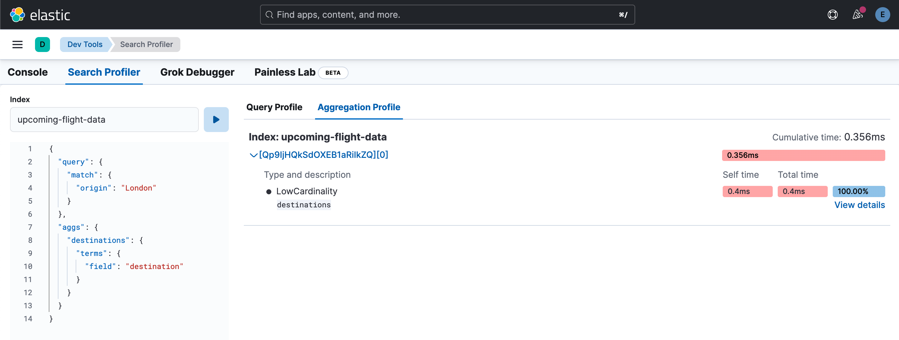
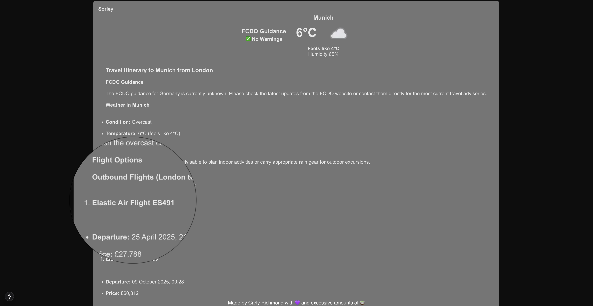

# Lab 2.6: RAG Integration

When building Oscar in [part 1](../1-oscar/) of this workshop, we added vector search to the application to make it a RAG app. Not only is it possible to add RAG capabilities as a tool to an AI application, it can also be traditional lexical, semantic (vector) or indeed hybrid search.

In this segment we shall add a simple RAG tool to enrich our itinerary with flight data.

## Steps

1. Please ensure you have ingested the sample flight data using the `ingestion.ts` script as covered in [lab 2.1](./2.1-data-ingestion.md).

2. Open your local Kibana instance on `http://localhost:5601` and navigate to the *Dev Tools* screen in Kibana. *Note you will need to use the username and password shown in the terminal when you initially ran the `start-local` script as per the [workshop prerequisites](../0-prerequisites.md)



3. Write a query to get the flights leaving from a particular airport. For example, a simple [match query](https://www.elastic.co/guide/en/elasticsearch/reference/current/query-dsl-match-query.html) to find flights departing from London would look like the following:

```json
GET upcoming-flight-data/_search
{
  "query": {
    "match": {
      "origin": "London"
    }
  }
}
```

4. Run the query through the [Search Profiler](https://www.elastic.co/guide/en/kibana/current/xpack-profiler.html), and examine the steps involved in the query:



5. Write a simple bucket aggregation to find the destinations that are reachable from your selected location. You can use your existing query alongside a [`terms` aggregation](https://www.elastic.co/guide/en/elasticsearch/reference/current/search-aggregations-bucket-terms-aggregation.html). Your example will look similar to the below query:

```json
GET upcoming-flight-data/_search
{
  "query": {
    "match": {
      "origin": "London"
    }
  },
  "aggs": {
    "destinations": {
      "terms": {
        "field": "destination"
      }
    }
  }
}
```

6. Run the query through the [Search Profiler](https://www.elastic.co/guide/en/kibana/current/xpack-profiler.html), and examine the steps involved in the query and aggregation phases:



7. Pick a location from the results of step 6 and use a [boolean query](https://www.elastic.co/guide/en/elasticsearch/reference/current/query-dsl-bool-query.html) to find flights from your origin to your chosen destination:

```json
GET upcoming-flight-data/_search
{
  "query": {
    "bool": {
      "must": [
        {
          "match": {
            "origin": "London"
          }
        },
        {
          "match": {
            "destination": "Madrid"
          }
        }
      ]
    }
  }
}
```

8. We are going to use this query in a new tool `flightTool`, located in `ai/flights.tool.ts`, to get outbound and inbound flights (hint, use the [multi search API](https://www.elastic.co/guide/en/elasticsearch/reference/current/search-multi-search.html) on the [Elasticsearch JavaScript client](https://www.elastic.co/guide/en/elasticsearch/client/javascript-api/current/index.html)):

```ts
import { tool as createTool } from 'ai';
import { z } from 'zod';

import { Client } from '@elastic/elasticsearch';
import { SearchResponseBody } from '@elastic/elasticsearch/lib/api/types';

import { Flight } from '../model/flight.model';

const index: string = "upcoming-flight-data";
const client: Client = new Client({
  node: process.env.ELASTIC_ENDPOINT,
  auth: {
    apiKey: process.env.ELASTIC_API_KEY || "",
  },
});

function extractFlights(response: SearchResponseBody<Flight>): (Flight | undefined)[] {
    return response.hits.hits.map(hit => { return hit._source})
}

export const flightTool = createTool({
  description:
    "Get flight information for a given destination from Elasticsearch, both outbound and return journeys",
  parameters: z.object({
    destination: z.string().describe("The destination we are flying to"),
    origin: z
      .string()
      .describe(
        "The origin we are flying from (defaults to London if not specified)"
      ),
  }),
  execute: async function ({ destination, origin }) {
    try {
      const responses = await client.msearch({
        searches: [
          { index: index },
          {
            query: {
              bool: {
                must: [
                  {
                    match: {
                      origin: origin,
                    },
                  },
                  {
                    match: {
                      destination: destination,
                    },
                  },
                ],
              },
            },
          },

          // Return leg
          { index: index },
          {
            query: {
              bool: {
                must: [
                  {
                    match: {
                      origin: destination,
                    },
                  },
                  {
                    match: {
                      destination: origin,
                    },
                  },
                ],
              },
            },
          },
        ],
      });

      if (responses.responses.length < 2) {
        throw new Error("Unable to obtain flight data");
      }

      return {
        outbound: extractFlights(responses.responses[0] as SearchResponseBody<Flight>),
        inbound: extractFlights(responses.responses[1] as SearchResponseBody<Flight>)
      };
    } catch (e) {
      console.error(e);
      return {
        message: "Unable to obtain flight information",
        location: location,
      };
    }
  },
});
```

9. Add the tool to our listing in `ai/chat/route.ts` and amend the prompt to ask the LLM to use the flight information:

```ts
import { openai } from '@ai-sdk/openai';
import { streamText } from 'ai';
import { NextResponse } from 'next/server';

import { weatherTool } from '@/app/ai/weather.tool';
import { fcdoTool } from '@/app/ai/fcdo.tool';
import { flightTool } from '@/app/ai/flights.tool';

export const maxDuration = 30;

export const tools = {
  getFlights: flightTool,
  displayWeather: weatherTool,
  fcdoGuidance: fcdoTool
};

// Post request handler
export async function POST(req: Request) {
  const { messages } = await req.json();

  try {
    const result = streamText({
      model: openai('gpt-4-turbo'),
      system:
      "You are a helpful assistant that returns travel itineraries based on location, the FCDO guidance from the specified tool, and the weather captured from the displayWeather tool." + 
      "Use the flight information from tool getFlights only to recommend possible flights in the itinerary." + 
      "Return an itinerary of sites to see and things to do based on the weather." + 
      "If the FCDO tool warns against travel DO NOT generate an itinerary.",
      messages,
      maxSteps: 2,
      tools
    });

    return result.toDataStreamResponse();
  } catch (e) {
    console.error(e);
    return new NextResponse(
      "Unable to generate a plan. Please try again later!"
    );
  }
}
```

What do you see?

## Expected Result

The final result is that the tool will also add in flight information to the itinerary:

