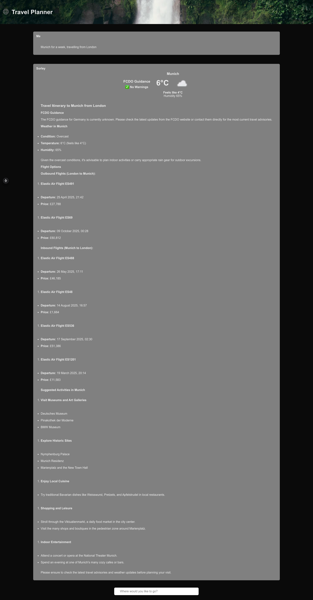

# Travel Planner AI Agent

Example Travel Planner Application Showing AI Agents Built Using AI SDK by Vercel and Elasticsearch.



## Prerequisites

To run this example, please ensure the [project prerequisites](../lab-sheets/0-prerequisites.md) are performed.

## Install & Run

Populate the `.env` file with your OpenAI key, Weather API key, Elasticsearch endpoint and Elasticsearch API key as per the below example, also available in [.example-env](.example-env):

```zsh
OPENAI_API_KEY=ARandomOpenAIKey?
WEATHER_API_KEY=MyWeatherKey!
ELASTIC_DEPLOYMENT=http://localhost:9200
ELASTIC_API_KEY=ARandomKey!
```

Once these keys have been populated, you can use [`direnv`](https://direnv.net/) or an equivalent tool to load them. Note that `.env` file detection requires explicit configuration using the [`load_dotenv` option](https://direnv.net/man/direnv.toml.1.html#codeloaddotenvcode) as covered [here](https://dev.to/charlesloder/tidbit-get-direnv-to-use-env-5fkn).

Load the sample flight data using [`tsx`](https://www.npmjs.com/package/tsx) or [`ts-node`](https://www.npmjs.com/package/ts-node):

```zsh
direnv allow
cd src/app/scripts
tsx ingestion.ts
```

Initialize and start the application:

```zsh
npm install # key dependencies: ai @ai-sdk/openai zod @elastic/elasticsearch
npm run dev
```
